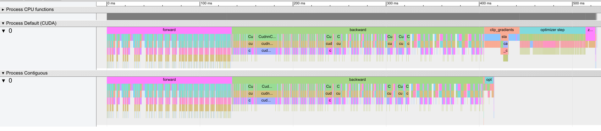
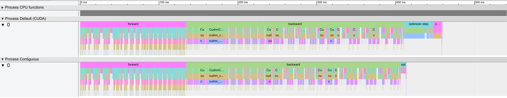

# Contiguous Parameters for Pytorch

Accelerate training by storing parameters in one contiguous chunk of memory.

## Speed up your optimizer with 3 lines of code! 
This graphic shows a GPU step trace comparison with and without contiguous params for a Resnet50 on Cifar10, using *Adam and gradient clipping*.
The upper trace is with the default optimizer, the trace below is with the parameter wrapper.


Step trace comparison for a Resnet50 on Cifar10, using *SGD*. 



## What's the difference to Apex?
Apex implements the full optimizer update in C++ and is limited to the supported
optimizers. This wrapper allows to use any optimizer as long as it updates the
parameters inplace.


## How does it work?
Launching Cuda kernels comes with a small overhead, resulting in low GPU utilization
when launching numerous fast-returning kernels. A typical example for this is the
optimizer step.
This package accelerates training by copying all parameters into one contiguous
buffer, resetting the parameters to be views into the buffer, and applying
optimizer updates on the contiguous representation. Depending on the model, the 
optimizer, the type of GPU used, etc, this can drastically reduce the time required for the optimizer's step function, resulting in speedups from anywhere between 7x to 100x.


For this to work, two requirements need to be fulfilled:
1. The computation graph may only alter the parameters and gradients inplace
   and should not replace the parameter/gradient tensors with new ones.
   Make sure to call `parameters.assert_buffer_is_valid()` to detect any buffer
   invalidation.
2. All operations executed on `parameters.contiguous()` must not rely on shape
   information or statistics of the parameter as these would be computed on the
   full buffer instead of each of the original parameters. For such operations,
   keep using `parameters.original()`.

## Disclaimer
This is still a rather new project and considered experimental. If you encounter
a bug, please file an issue if there is no matching existing issue! Also, if you
find this project helpful, consider leaving a star to keep me motivated or spread
the word and help people to train their models faster :)

## Install
```
pip install git+https://github.com/philjd/contiguous_pytorch_params.git
```

## Example Usage
```python
import torch
from torch import nn
from contiguous_params import ContiguousParams

data = torch.randn(5, 1, 8)
model = nn.Sequential(nn.Linear(8, 8), nn.Linear(8, 8))

# Create the contiguous parameters.
parameters = ContiguousParams(model.parameters())  # <--- (1) Wrap parameters.

# Use parameters.contiguous() instead of model.parameters() to initialize
# the optimizer. Note that the optimizer must update the parameters inplace.
optimizer = torch.optim.Adam(parameters.contiguous())    # <--- (2) Optimize view.

# Run the training loop as usual.
for x in data:
    loss = model(x).sum()
    loss.backward()
    # Gradient clipping also profits from contiguous memory.
    nn.utils.clip_grad_norm_(parameters.contiguous(), 0.1)
    optimizer.step()
    optimizer.zero_grad()
    # !!!!!!!
    # Always make sure to call buffer_is_valid() at least once, to detect
    # if operations invalidated the buffer by overwriting/copying parameters.
    # (Except when running in DDP mode, there the buffer check doesn't work.)
    # !!!!!!!
    parameters.assert_buffer_is_valid()  # <--- (3) Check that the optimizer only applies valid ops.
``` 

## Debugging
Common Problems that might occur:
- The loss is not going down. One reason for this could be that gradients are
  disconnected and don't use the contiguous grad buffer. This can happen
  when the optimizer with the contiguous params is created before moving the
  model to its device. A good check is to verify that the gradient_buffer
  tensor is non-zero.
- A function updates a parameter with an operation that is not inplace (inplace
  ops have an underscore suffix). This can be catched with the
  `ContiguousParams.assert_buffer_is_valid()` function, so make sure to use it
  at least once per forward pass.
- Operations try to change the parameter views inplace. This happens for
  example when `nn.Module.zero_grad()` is used instead of
  `optimizer.zero_grad()`. Either override your module's zero_grad function
  to link to the optmizer's zero_grad or manually `zero_` the contiguous grad
  buffer.


## Testing
```
pytest test.py
```

## Benchmarking
Run `python benchmark.py`. This applies several updates with the original method
as well as using contiguous parameters. You should see a speed up of ~100x.
To take a look at the timeline, open chromium, navigate to `chrome://tracing/`,
click load, and select the `*timeline.json` file.

## Distributed Data Parallel Training
Training with DDP is also easy, we just need to make sure that the parameters for each replica are contiguous.
To understand where we should insert the ContiguousParams into our `nn.Module`, let's first recap how DDP
works:
1. Create the reference model.
2. Replicate the model onto the respective devices.
3. Wrap as DDP module. This creates hooks between gradients, ensuring that they
   get synced across devices during `backward`. Note: DDP does not allow Parameters to change
   after this step.
4. Initialize an optimizer for each device with the device's parameters. Each
   device calls `optimizer.step` for its own parameters but with the same
   gradients, due to syncing. This means we perform the same update on each
   device and end up with the same set of parameters, saving the round of
   syncing of parameters before the forward pass, which would be necessary if
   we would use only one device for computing `step`.

This means, the contiguous parameters need to be created after step 2 but
before step 3. The easiest way to do this is to create your optimizer after
moving the model to the desired device, otherwise you need to wrap the `Module.cuda`
and `Module.cpu` functions and recreate the contiguous parameters there.
Note: the buffer invalidation check currently doesn't work with DDP.

Contiguous params work with pytorch_lightning's DDP implementation for versions > 0.9
or on master after [this commit](https://github.com/PyTorchLightning/pytorch-lightning/commit/e3528afae3f178cf9d5d8ea6bc3f8a876646054a).
